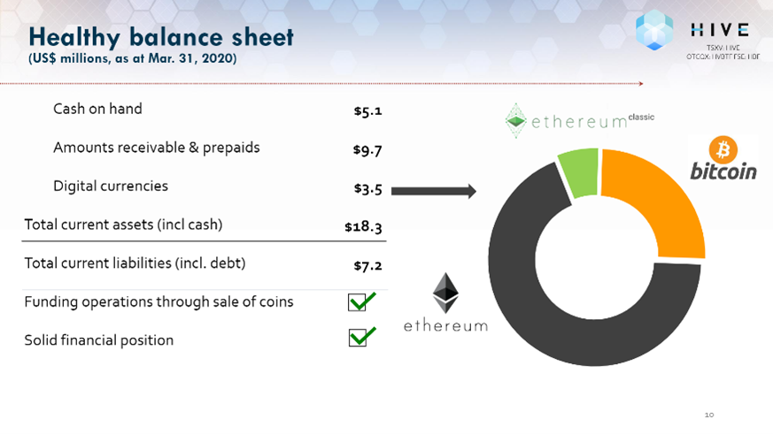
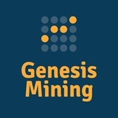
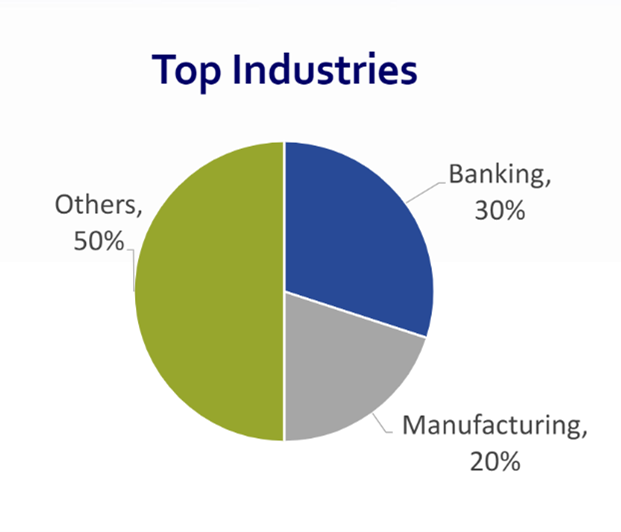
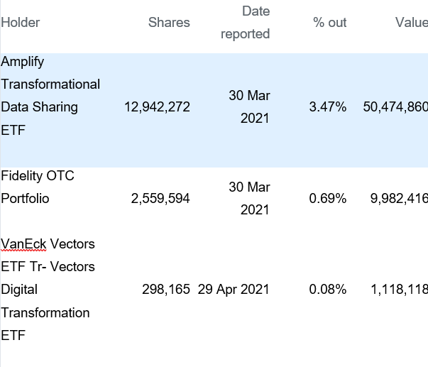
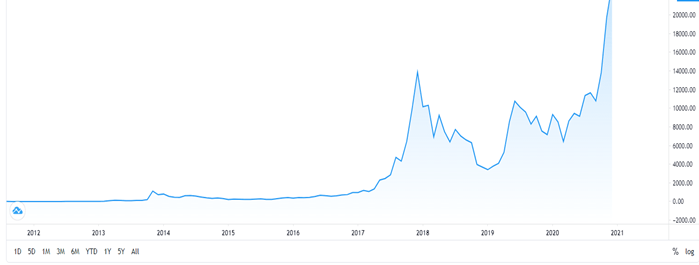
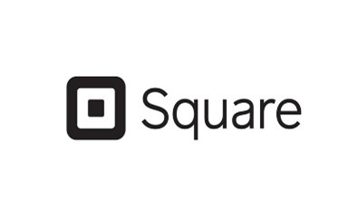

## WHAT IS BLOCKCHAIN TECHNOLOGY?
Blockchain is a system of storing information which cannot be or impossibly hacked, changed or stolen easily. The information is usually stored in several blocks which all together makes a chain and hence the word is called BLOCKCHAIN. The way blockchain technology works is whenever a new block of information is added every computer with the associated network makes the changes and updates the blockchain. These blocks have specific storage which is once filled are added to the previously filled block. 

## HIVE BLOCKCHAIN
### OVERVIEW AND ORIGIN:
Hive blockchain is one of the leading digital mining companies mainly focused on mining of Bitcoin and Ethereum in Canada, Iceland and Sweden. With the increasing demand of digital banking and cryptocurrencies in todays modern era, Hive blockchain has been emerging as one of the greatest blockchain technology companies powering the future of blockchain computing.
The company was incorporated in 1987 formerly known as Leeta Gold Corp which was a Gold mining company and later incorporated as Hive blockchain in 2017. During the transition from Leeta to Hive, there were some interesting facts which emerged as a great surprise for the investors i.e. in the initial three days the company raised almost $30 million in a share led by GMP Securities and there was a wave in the market that World's greatest gold mining companies, is digging for another gold which was cryptocurrencies in this scenario.
Hive was founded by one of the greatest technology leader Olivier Roussy Newton which was also a strategic advisor when the company was initially started their operations. Olivier is presently partnered at one of the leading investment fund companies mainly focused on Fintech, bioinformatics and quantum computing. His past experience and knowledge has helped Hive blockchain to explore new opportunities and navigate great challenges.
Blockchain technology has been transforming banking and finance industries and there are several ways in which investors can get exposures in these sectors. 
I started studying about cryptocurrency last year and started investment at the same time. Hive was one of the best investments I've ever made so far. Initially it was just an advice from one of my friends by eventually when I got a good return I thought I should do a through analysis of the company. With an upcoming Nasdaq listing and one of the greatest recommendations by many experienced individuals, I thought working on this domain and company would help me and my classmates to get a better understanding about blockchain technology. 

                                   https://hiveblockchain.com/investors

### The company is funded by two main investors:

     

### 1) Genesis Mining: 
Holds 14.6% shares of the company.
The company was founded in 2013. One of the leading has power companies which converts the altcoins to Bitcoins followed by the customers wallets.
The latest funding was raised in January and they have most recently received a funding of $176.4 million from a post IPO debt round which is only possible when the company goes public.
### 2) US Global investors:
It is mainly specialized in managing equity and bond strategies. With an expertise in gold and other metals, U.S Global investors have been moving towards the crypto mining companies and Hive is one of the companies which is receiving funding from them.

### BUSINESS ACTIVITIES:
Problem company is trying to solve:
Due to lack of cryptocurrency in the market, the company is mainly focused on the cryptocurrency mining which includes Ethereum and Bitcoin. Since the mining of cryptocurrency usually takes a lot of energy which is not environmentally friendly therefore Hive is also focused on reducing the emission of these energies which could be beneficial for the environment and ecosystem. With low energy cost and low-cost electricity, it has caught a great attention in the market. Due to the shortage of digital currencies in the market the company has also increased the operations in order to expedite the mining of crypto.

Hive is known as one of the most diversified public cryptocurrencies with targeting public and several institutions being the intended customers. It is one of the mostly traded stock among Canadian listed companies with a market cap of almost 1.08 Billion.

	
 There are several miners in the market today but some of the key competitors of Hive are Bitfury, Elliptic, Ethos IO and so on. Mining firms usually provide cloud mining services to clients in order to mine their own coins which is a relatively different for Hive since it is a publicly traded company and hence is a self operating which means leasing hash is not transferable. Since Hive has its offices located in Canada, Sweden and Iceland therefore there are several differences which amongst Hive and its competitors including low-cost electricity, fast internet and low temperature zone.

Hive is using a blockchain technology and owns graphics processing units powered by renewable hydro electricity and geothermal energy with a capacity of ~17 mega watt and inbuilt custom GPU rigs which is suitable for mining Bitcoin and Ethereum. It also has an electricity contract with Hydro Quebec which means significant power available for mining operations. Hive has also acquired the 30-megawatt capacity mining operation which means it is one of the most efficient public miners with ~24 PH/sec (Petahash) per megawatt electricity used.

### LANDSCAPE:
The company is mainly focused on digital banking which includes the use of cryptocurrencies and blockchain technology. With the increasing demand of digital banking amongst various institutions Hive blockchain has emerged as one of the greatest blockchain companies. 
In todays modernization, blockchain and cryptocurrencies are one of the most demanding digital assets. 
The most important reason is their sustainability and security. The trend has indeed been changed in the past years and will be changing in the coming years because of the several pros which crypto currency has. Cryptocurrency, which in real life only exists as a digital asset has several advantages including strong security, maintains the privacy, easy transfers and decentralizations. Several institutions have also started accepting cryptocurrency which means that the public are getting used to this chance. One of the main reasons for this acceptance is the authenticity and security.

     
     
MAJOR COMPETITORS:
     		
	

### RESULTS:
Hive is one of the leading public cryptocurrency company which has mining operations globally. With the increasing demand of cryptocurrencies, the company is performing really well and helping the market overcoming the shortage of Bitcoin and Ethereum. Since past year, hive has been one of the mostly traded blockchain stocks in the market and is expecting an upcoming Nasdaq listing in the upcoming days. The reason for increasing market cap and average volume is because the investors does not need a trading account or crypto account in order to make an investment in HIVE which means it is available to each investor in the market without any restrictions.
The company measures success based on its mining capacity and the company has just bought M30s miners. The company has mined more than 32000 Ethereum in the last quarter of 2020 and passed a market cap of 1Billion most recently. The company has also anticipated a market spending on blockchain in the next 3 years to $15.9 Billion. The smart contracts would definitely drive blockchain technology in future.

The company is performing quiet well as compared to its main competitors including Riot blockchain, Galaxy digital and Marathon digital holdings. The advantage which Hive has as compared to its competitors is that it mines both Ethereum and Bitcoin whereas its competitors only focus on mining Bitcoin. 
 Due to speculation and uncertainty in market it�s always better to have an alternative which Hive already has.

### RECOMMENDATIONS:
I would suggest that the company should offer a dividend to the shareholders which means more people will invest in the company which would eventually help the company in growing. Since the company is growing every day therefore it should also expand its operations and could include mining of other cryptocurrencies including Cardano which is one of the most environmentally friendly crypto. The company is not doing marketing; therefore some marketing would definitely help the company to gather more attention and would help the company to have more institutional investors. The company should also focus on acquisition of small Canadian companies such as Cryptostar and DMG blockchain.
The offering of dividend would benefit the company since more people will be investing in the company just to get the quarterly dividend which would pump the stock price up and will eventually help company in generating more revenue. Acquisition of small Canadian companies will increase the market cap which would force the institutional investors to invest followed by the more demand in the market. They should also focus more on the Defi technology which does not really rely on the brokerages or exchanges.
Well, acquisition would definitely require purchasing more equipment and more advanced technology. Equipment such as Antiminers S19 pro, M30 Whatsminer and a good graphic processing unit will be required. In order to provide the dividend to the shareholders, a mutual consent from the board of directors will be required. The defi technology will help company maintain authenticity and will gain amongst the investors.
These technologies are appropriate because it will definitely help the company to grow not only in Canada but globally. Acquisition will not only help the company to generate more revenue but will also help in generating more employment opportunities. Purchasing of equipment will help the company to mine more cryptocurrencies which will be an advantage as compared to other mining firms. 

### References:
https://www.theglobeandmail.com/

globe-investor/investment-ideas/frank-giustra-backed-firm-hive-switches-from-mining-gold-to-bitcoin/article36572363/

https://hiveblockchain.com/corporate/about/

https://www.crunchbase.com/organization/hive-blockchain/company_financials

https://nz.finance.yahoo.com/quote/HVBTF/holders?p=HVBTF

https://hiveblockchain.com/

https://www.newswire.ca/news-releases/hive-blockchain-increases-bitcoin-mining-production-immediately-with-the-purchase-of-1-240-next-generation-miners-while-upgrading-its-gpu-chips-to-mine-ethereum-in-the-cloud-828763111.html

https://hiveblockchain.com/news/

https://coincentral.com/how-to-buy-cryptocurrency-with-paypal/

https://sea.pcmag.com/small-business-reviews-and-price-comparisons-from/16294/square-point-of-sale-review
https://seekingalpha.com/article/4394500-microstrategy-doubles-down-on-bitcoin-what-you-need-to-know

https://www.prnewswire.com/news-releases/riot-blockchain-continues-to-increase-production-efficiencies-and-aggressive-expansion-of-bitcoin-hash-rate-reaching-567-phs-with-latest-purchase-301070373.html

https://btcmanager.com/mastercard-cryptocurrencies-network/

